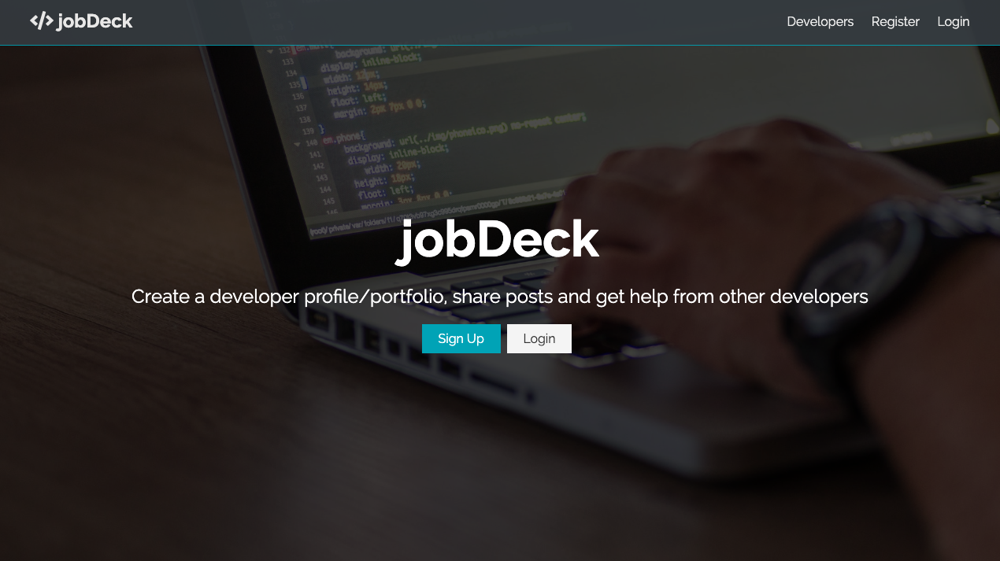

# jobdeck

## Overview

jobDeck is an employee/employer matching site looking to pair Tech professionals with leaders in the Tech Industry. Our developmental focus was on creating a site where developers, team leads, recruiters, and more can connect based on skillset rather than networking ability.

jobDeck was created using React, Redux, MongoDB, Express, NodeJS, and Google Firebase 

### We wanted jobDeck to be able to deliver
    - Employer Posted Job Listings
    - Company Profiles
    - User Profiles
        - Streamlined User Profiles
        - Personalized Resume Hosting
    - A Simplified Job Search
    - A User Forum
    - A Robust User Interface

## Application Use

 ### Developer Use : 
     `Clone Repo > Run 'npm i' in your terminal > 'npm run dev' to start software`

### Getting Started

You can link to our hosted application here: 

After arriving at the landing page, feel free to create your login account.

### Welcome Users!

If you've registered as a professional seeking employment, you'll be asked to create your profile.

Populate your new profile with relevant information including Skills, Work History, Location, etc. and even upload your Resume to be seen by recruiters in their search.

After finishing your profile, you'll be taken to the Dashboard, where you are just one click away from editing/exploring your own profile or from exploring relevant job posts.

While you're logged in, feel free to leave a message on our "Post" forum.

### Welcome Recruiters!

If you've registered as a recruiter posting on behalf of an employer, you'll be taken to the recruiter dashboard.